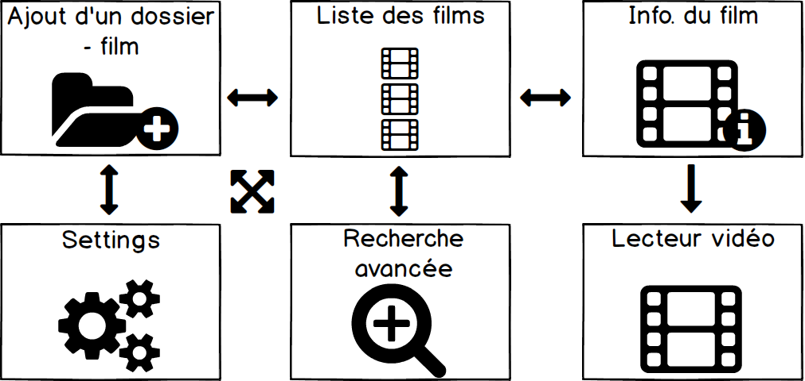

# Mawie
> Par Ilias, Thomas et Eric

# Table des matières
<!--
- Technologies
- BDD & Modèles
- Composants
  - Explorer
  - Search
  - Updator
  - Gui
  - Event handling
- Bugs restants
- Améliorations
- Conclusion
- Q/A -->
<div style="display:inline-block;float:left;width:40%">
  <ul>
    <li>Technologies</li>
    <li>BDD & Modèles</li>
    <li>Composants</li>
    <ul>
      <li>Explorer</li>
      <li>Search</li>
      <li>Updator</li>
      <li>Gui</li>
      <li>Event handling</li>
    </ul>
  </ul>
</div>
<div style="display:inline-block;width:40%;margin-left:100px;">
  <ul>
    <li>Bugs restants</li>
    <li>Améliorations</li>
    <li>Conclusion</li>
    <li>Q/A</li>
  </ul>
</div>

# Technologies
 - Python3
 - SqlAclhemy (ActiveAlchemy)
 - sqlite3
 - PyQt5

Note:

Tkinter (déprécié - semaine 5-6)

On a développé l'application pour qu'elle soit orienté événement (comme une application Android).

# BDD & Modèles

 

 Note: données du dump de la librairie imdbpie


# Composants


# Search
Recherche sur les 2 modèles, ou autre.

- Namepsace : mawie.research

- Recherche Simple
- Recherche Avancée
- Recherche Avancée (2)

##^ Recherche simple
```python
  from mawie.research.research import Research
  from mawie.models.movie import Movie
  searchable = Research()
  res = searchable.query("Some awesome movie title")
  for elem in res:
    assert isinstance(elem, Movie)
    print(elem.title)
```

##^ Recherche Avancée
```python
... imports
searchable = Research()
res = searchable.query("Some awesome movie title",["desc","actors"])
for elem in res:
    assert isinstance(elem, Movie)
    print(elem.title)
```

##^ Recherche Avancée (2)

```python
... imports
searchable = Research()
res = searchable.query({Movie:{"release":{"gte":"2010-01-01","lte":"2016-01-01"}}})
for elem in res:
    assert isinstance(elem, Movie)
    print(elem.title)
```

# Explorer

- Qu'est-ce que c'est
- Namespace : mawie.explorer
- Utilise des Apis (duckduckgo, et imdb)


Note:
Utilise le système d'événements pour communiquer

##^ 1ère approche : Comparateur de chaine de caractère

_"La distance de Levenshtein est une distance mathématique donnant une mesure de la similarité entre deux chaînes de caractères. "_
Lowercase/Uppercase
```python
    >>> from Levenshtein import distance
    >>> distance("La vie d'adèle", "La.vie.d'adele.french")
    >>> #           ^   ^    ^  ^
    10
```
Taux minimum pour validation : ~80%.

Note:

La distance Levenstein est égale au nombre minimal de caractères qu'il faut supprimer, insérer ou remplacer pour passer d’une chaîne à l’autre.

##^ 2ème approche : Utilisation de duckduckgo

Dans un deuxième temps on a développé une solution plus simple. On recherche le nom du film donnée par Guessit sur duckduckgo.
Cela permet de le traduire, et d'avoir beaucoup plus souvent des résultat de recherche cohérent (dépendant du film).
Après avoir récupéré le contenu imdb, on fait un test de semblance entre le nom Guessit, et le nom retiré IMDB pour vérifier que l'on ait bien trouvé le bon film, puis on l'inspre dans la base de donnée.

# Updator

- Namespace : mawie

Exécute une tâche périodiquement.

Met à jour la liste de film.


# Gui

- Namespace : mawie.gui

## Navigation

</div>

##^ Ajout de nouveaux films


##^ Affichage du contenu d'une recherche


##^ Affichage des informations d'un film


##^ Visionnage d'un film


##^ Recherche avancée


##^ Settings


# Gestion d'événements


Note:

Permet d'etre completement asynchrone (comme sur android)

Utiliser pour que les widgets QT communique ensemble
Utiliser pour que les service d'arrière plan communique ensemble
Utiliser pour que le Gui et l'arrière plan communique

##^ Entre composants QT

On utilise les signaux Qt, et ensuite on communique les données à l'arrière plan avec le système d'événements.

##^ Entre service d'arrière plan

On utilise une solution faite maison qui reprend l'idée d'un MessageBroker (AMQT, ZeroMq, etc...)


Note:

On fait tourner un event loop dans le GUI (pour passer les données à l'arrière plan).

On fait tourner un Event loop dans un thread à part pour processer les événements toute les .25s (pour le pas surgargé le thread principale QT!)

Tout ça à cause du GIL

# Améliorations

- Gui
- Explorer
- Recherche
- Updator
- Système d'événements
- Implémenter complétement le cli

##^ Gui

- Améliorer l’ergonomie

- Rendre plus responsive

- Faire une fenêtre adaptée pour les séries

- Ajouter la possibilité de donner un nom de film
pour les fichiers qui n’ont pas été parsés

- Indiquer le film comme «viewed» lorsqu’on a cliqué sur le bouton «play film»

##^ Explorer

- Permettre d'utiliser le module indépendamment du système d'événements
```python
... imports
e = Explorer()
e.parseDirectory("path/to/my/super/movie/dir")
```
- Gérer la perte de connexion à internet
- Gérer des sources différentes pour la recherche d'information
- Inclure l'utilisateur lors du parsing dans le cas où un fichier n'est pas trouvé

##^ Recherche

- Mettre en cache les requêtes

##^ Updator

- Ajouter d'autres tâches à exécuter
- Permettre à des class d'enregistrer de nouvelle tâche à faire
- Permettre à l'utilisateur de séléctionner les tâches à exécuter

##^ Système d'événements

- Ajouter une queue pour les messages de retour

- Permettre de dispatcher un événement à un object particulier

Note:

Utiliser une queue de message de retour pour ne pas occuper la queue d'événement principale

# Bugs restants

- Gui
- Explorer
- Système d'événement

##^ Gui
- La fenêtre dépasse si l’écran est trop petit
- Pas de gestion des formats non pris en charge par le lecteur média personnalisé
- Problème de l'affichage du film sous Linux


# Conclusion


# Question
```python
import sys
sys.stdout.write("Questions ? ")
```
