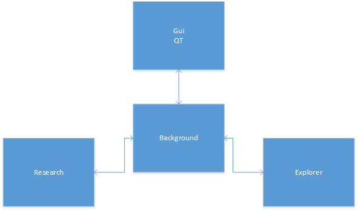
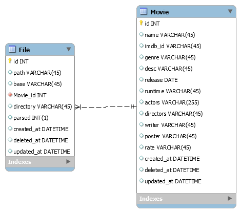
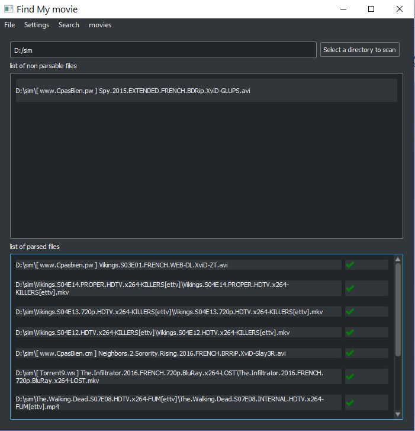
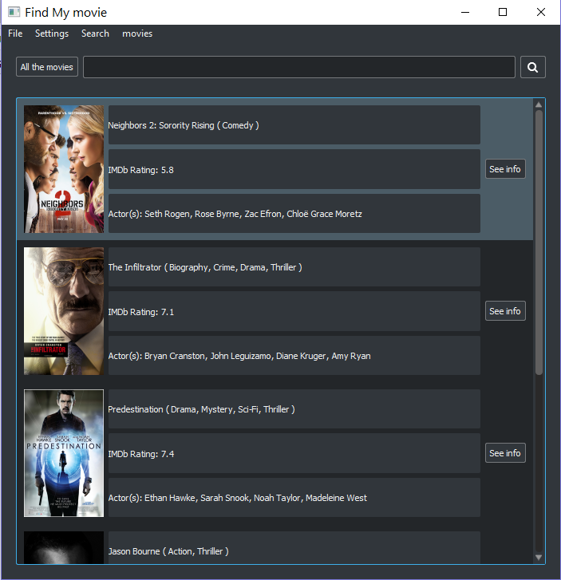
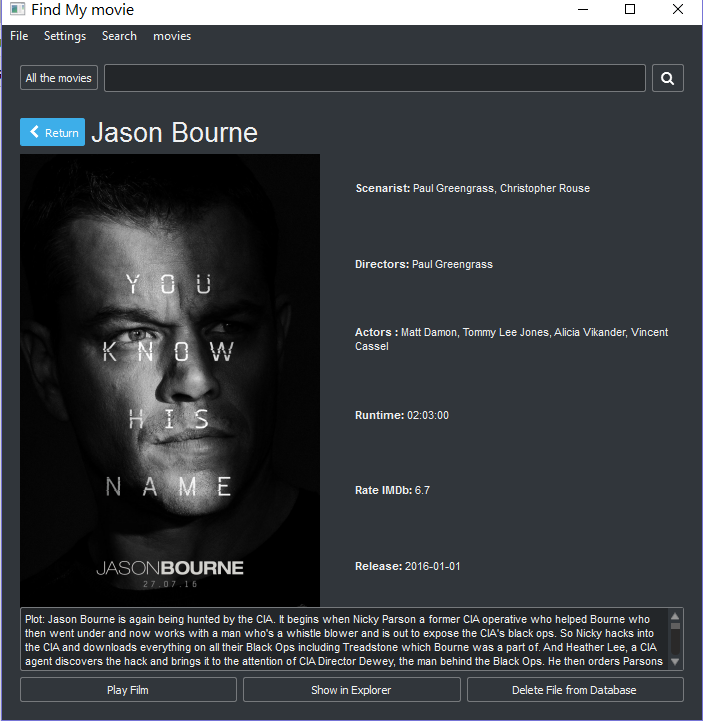
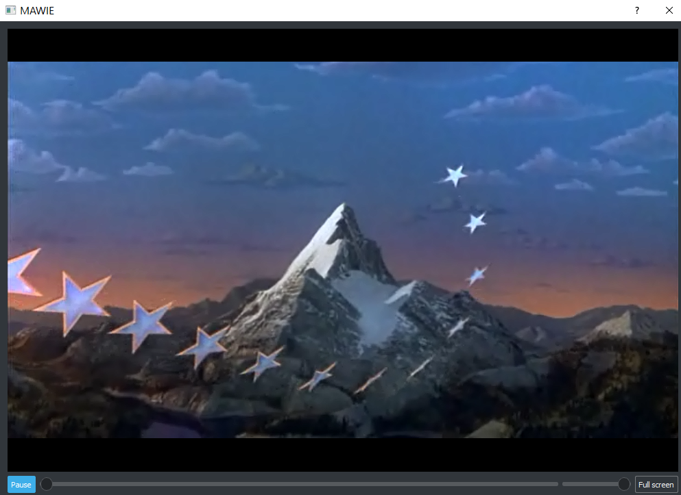
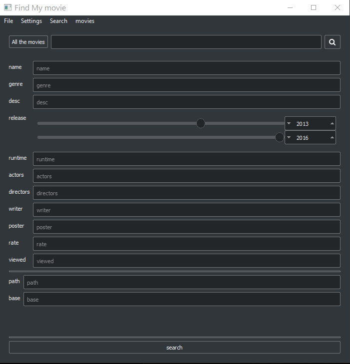
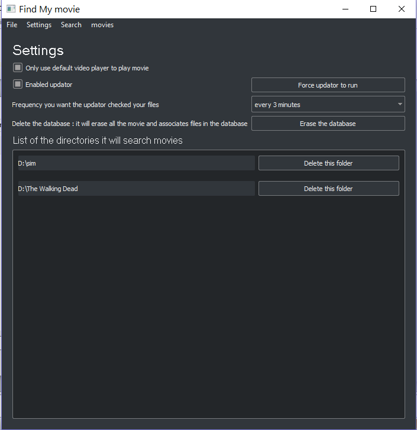
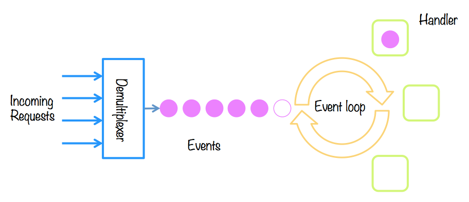

# Mawie

#### Par Ilias, Thomas et Eric

# Tbl des matières
- Technologies
- BDD & Modèles
- Composants
- Explorer
- Search
- Gui
- Event handling
- Bugs restants
- Améliorations
- Conclusion
- Q/A


# Technologies

 - Python3
 - SqlAclhemy (ActiveAlchemy)
 - sqlite3
 - PyQt5
 - Tkinter (déprecié)
 
 On a développé l'application pour qu'elle soit orienté événement (comme une application Android).


# Composants

<div style="text-align:center">
</div>


# Search

Recherche sur les 2 modèles, ou autre.

- Recherche Simple
- Recherche Avancé sur les modèles par defaults
- Recherche Avancé


```python
  from mawie.research.research import Research
  from mawie.models.movie import Movie
  searchable = Research()
  res = searchable.query("Some awesome movie title")
  for elem in res:
    assert isinstance(elem, Movie)
    print(elem.title)
```


```python
... imports
searchable = Research()
res = searchable.query("Some awesome movie title",["desc","actors"])
for elem in res:
    assert isinstance(elem, Movie)
    print(elem.title)
```


```python
... imports
searchable = Research()
res = searchable.query({Movie:{"release":{"gte":"2010-01-01","lte":"2016-01-01"}}})
for elem in res:
    assert isinstance(elem, Movie)
    print(elem.title)
```


# Explorer

## Utilisation d'un comparateur

Dans un premier, on a utilisé Levenstein pour comparaitre le nom du film que nous renvoyait Guessit, et le nom du fichier originel (si taux de ressemblance plus haut que 80% c'est OK)

Cela était due au nom des fichier impropable dans le dossier.

## Utilisation de duckduckgo

Dans un dexuipme temps on a développé une solution plus simple. On recherche le nom du film donnée par Guessit sur duckduckgo.
Cela permet de le traduire, et d'avoir beaucoup plus souvent des résultat de recherche cohérent (dépendant du film).
Après avoir récupéré le contenu imdb, on fait un test de semblance entre le nom Guessit, et le nom retiré IMDB pour vérifier que l'on ait bien trouvé le bon film, puis on l'inspre dans la base de donnée.


# BDD & Modèles

<div style="text-align:center">
</div>

Note: données du dump de la librairie imdbpie


# Gui : navigation
## Les différentes fenetres


# Gui : Fenêtres
## ajouter un dossier
<div style="text-align:center">
</div>


# Gui : Fenêtres
## Affichage le contenu d'une recherche
<div style="text-align:center">
</div>


# Gui : Fenêtres
## Affichage des informations d'un film
<div style="text-align:center">
</div>


# Gui : Fenêtres
## Lire le film
<div style="text-align:center">
</div>


# Gui : Fenêtres
## Recherche avancée
<div style="text-align:center">
</div>


# Gui : Fenêtres
## Settings
<div style="text-align:center">
</div>


# Gui : Améliorations

- Améliorer l’ergonomie

- Rendre plus responsive

- Faire une fenêtre adaptée pour les séries

- Ajouter la possibilité de donner un nom de film
pour les fichiers qui n’ont pas été parsés

- Indiquer le film comme «viewed» lorsqu’on a -cliquer sur le bouton «play film»


# Gui : Bugs restants

- La fenêtre dépasse si l’écran est trop petit
- Pas de gestion des formats non pris en charge par le lecteur media personnalisé
- Sous Linux, le fichier ne se montre pas dans l’explorer


# Gestion d'événement
## Entre composants QT

On utilise les singaux Qt, et ensuite on communique les données à l'arrière plan avec le système d'événement.

## Entre service d'arrière plan

On utilise une solution faite maison qui reprend l'idée d'un MessageBroker (AMQT, ZeroMq, etc...)

<div style="text-align:center">
</div>

Note: On fait tourner un event loop dans le GUI (pour passer les données à l'arrière plan).

Note: On fait tourner un Event loop dans un thread à part pour processer les événements toute les .25s (pour le pas surgargé le thread principale QT!)

Note: Tout ça a cause du GIL
